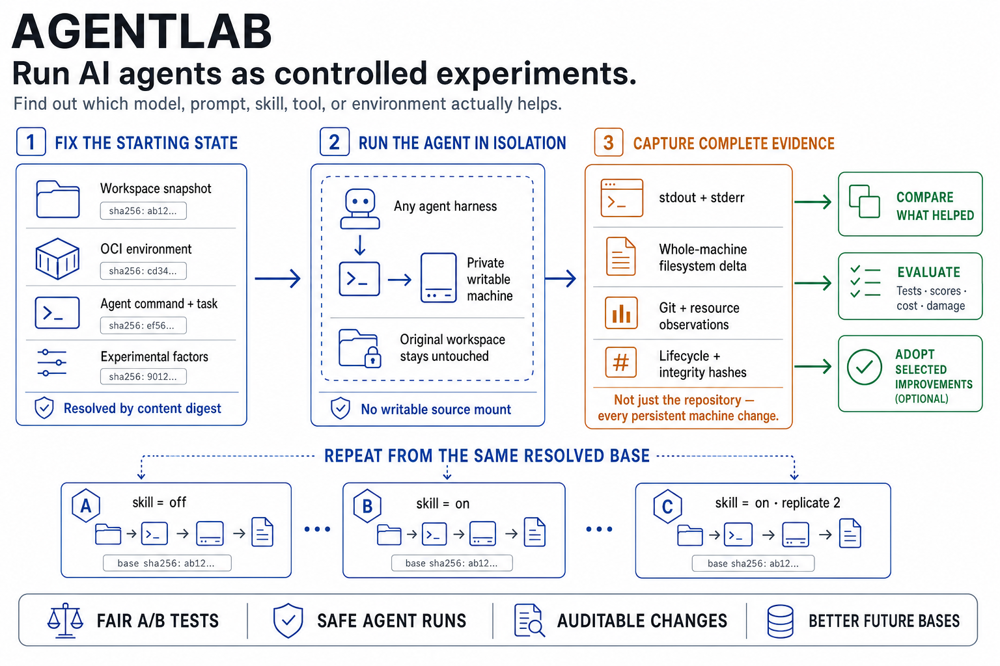

# AgentLab

AgentLab is a thin, layout-agnostic primitive for running agentic sessions from content-addressed inputs in scientifically comparable isolation.



The durable model is:

```text
immutable input
    → isolated execution
    → complete observation and filesystem delta
```

Milestones 1 through 5 implement deterministic workspace snapshots, isolated and comparable direct-Docker execution, retained filesystem lifecycle, and external evaluation. AgentLab reconstructs the snapshot in private container storage, runs one opaque command, records a portable whole-root-filesystem delta without mounting the source workspace, can later stop, continue, fork, inspect, or remove that state, and lets arbitrary external commands attach structured observations without turning any score into a universal judgment.

## Current capabilities

- Snapshots any selected directory without prescribing its layout.
- Includes regular files, directories, hidden and ignored paths, untracked content, Git metadata, empty directories, large files, modes, and symlink targets by default.
- Excludes nothing based on `.gitignore` unless the user deliberately selects `--respect-gitignore`; explicit filtering uses Git's root and nested wildmatch and negation semantics.
- Discovers Git repositories automatically and keeps tracked files even when an ignore rule matches them.
- Prevents machine-global Git excludes from affecting snapshot selection.
- Stores file bodies as reusable SHA-256-addressed blobs outside the source workspace.
- Produces a canonical snapshot identity and a versioned JSON manifest.
- Inspects paths, hashes, sizes, modes, symlink targets, repositories, and ignore-rule identity without printing file contents.
- Verifies manifest and blob integrity.
- Fails precisely on unsupported special files instead of silently dropping them.
- Resolves an OCI image immutably and executes one command in a uniquely named retained Docker container.
- Optionally injects the host's default Pi authentication file from private runtime memory, records only the injection name, and removes it before filesystem export.
- Captures persistent changes across the complete guest root filesystem, including content, modes, types, symlink targets, and deletions.
- Records raw and `.agentlabignore`-filtered deltas, stdout, stderr, nonzero exit status, lifecycle events, Docker evidence, requested captures, and integrity hashes.
- Rejects image volumes and external writable mounts that would escape complete root-filesystem observation.
- Runs directly from either a mutable host directory (snapshotted at invocation) or an already stored snapshot digest.
- Shows elapsed-time progress, streams guest stdout/stderr live, and recaptures a direct source workspace after execution to report whether it remained unchanged.
- Derives a canonical run-input identity from the actual snapshot, resolved image, command, resource/network policy, captures, ignore rules, backend, and AgentLab version.
- Supports concurrent independent runs and verifies exact repetitions or reports which real controlled inputs differ.
- Retains a stable container supervisor so stop/start never reruns the original agent command.
- Supports integrity-checked harness continuation from the exact filesystem, while explicitly reporting that process memory was not restored.
- Creates independent filesystem-level forks and deletes only the selected run's owned container, image tag, and local artifacts.
- Invokes arbitrary external evaluators against integrity-checked results and records their command, output, status, stdout/stderr, and named JSON observations.
- Aligns actual run-input, workspace, image, portable-base identities, and evaluator score names into Markdown or JSON rows without aggregation, ranking, statistics, or causal claims.

AgentLab does not attempt to make a transactionally consistent snapshot of a workspace that is being modified concurrently. It detects changes to regular files while reading them and asks the user to retry from a stable source.

## Requirements

- Rust 1.85 or newer, including Cargo.
- Git available in `PATH` when a workspace contains `.gitignore` files or Git repositories.
- Docker Engine for `agentlab run` (Docker Desktop is sufficient on macOS).

Git is used as the repository-discovery and explicit ignore-semantics authority. When `--respect-gitignore` is selected, AgentLab evaluates workspace ignore files through temporary Git metadata outside the workspace and disables machine-global and system Git configuration. Repository discovery uses read-only Git commands with optional locks disabled.

## Quick start

Build the development CLI:

```bash
cargo build --release
./target/release/agentlab --version
./target/release/agentlab --help
```

For a repeatable Linux development install that builds through rootless Docker, installs under `~/.local/bin`, and embeds the exact Git commit, see [Dogfooding development builds](docs/DOGFOODING.md).

Snapshot a workspace of your choosing:

```bash
./target/release/agentlab snapshot --workspace /path/to/workspace
```

Complete capture is the default. The command prints a stable digest and an inclusion/exclusion summary:

```text
Snapshot: sha256:...
Workspace: /absolute/path/to/workspace
Capture: all
Included paths: ...
Excluded paths: 0
Repositories discovered: ...
Logical file bytes: ...
Content blobs: ... new, ... reused
Workspace-ignore rules: sha256:...
```

Use `--respect-gitignore` only when those exclusions are a deliberate experimental input. The earlier `--capture all` spelling remains accepted as a compatibility alias.

Inspect and integrity-check the snapshot without printing captured contents:

```bash
./target/release/agentlab inspect --verify sha256:...
```

Repeat the snapshot without changing the source. The snapshot digest will be identical and previously stored file blobs will be reused.

Use `--json` with `snapshot` or `inspect` for machine-readable output.

Run a harmless command against a private reconstruction of the snapshot you just inspected:

```bash
SNAPSHOT=$(./target/release/agentlab snapshot \
  --workspace /path/to/workspace --json | jq -r .digest)

./target/release/agentlab run \
  --snapshot "$SNAPSHOT" \
  --image ubuntu:24.04 \
  --network none \
  -- /bin/sh -c 'printf "guest only\n" > /workspace/agentlab-proof.txt'
```

`run --workspace /path/to/workspace` is the first-run form: it captures every supported workspace path, runs that exact result, streams guest output, and recaptures the source afterward to report whether it remained unchanged. Use `--respect-gitignore` only for a deliberate filtered input. Use `--snapshot DIGEST` when exact repetition matters. Progress and live guest output use stderr when `--json` reserves stdout for the final machine-readable summary. The human summary includes a run ID, canonical run-input digest, command exit code, portable and ignored change counts, source status, retained container, and ready-to-paste follow-up commands.

```bash
./target/release/agentlab inspect --verify RUN_ID
./target/release/agentlab diff RUN_ID
./target/release/agentlab diff --raw RUN_ID
```

Use `--capture /guest/path=NAME` to export a selected path as a tar artifact and `--change-ignore PATH` to override the snapshotted workspace-root `.agentlabignore`. Network access defaults to Docker `bridge` mode so model-backed harnesses work without another flag. Use `--network none` when the run must be offline.

Use `--pi-auth` when the command needs the invoking host's default `~/.pi/agent/auth.json`:

```bash
./target/release/agentlab run \
  --workspace /path/to/workspace \
  --image IMAGE \
  --pi-auth \
  -- pi --help
```

AgentLab validates the JSON, places it in a private tmpfs, links it at the container user's Pi auth path only while the initial command runs, and removes both paths before inspection and root-filesystem export. The run specification records the name `pi-auth`, never the host path, credential bytes, or a credential digest. This prevents AgentLab itself from persisting the injected file; the opaque command remains trusted with the credential and can still print or copy it. Continuation commands do not currently reinject it.

The container remains running under an inert shell supervisor after the initial `docker exec` command completes. This makes later stop/start truthful: restarting the container starts only the supervisor and never reruns the original command.

Launch independent runs concurrently using ordinary processes. Reuse one snapshot digest for repetitions; create a new snapshot only after making a real treatment change to the host workspace:

```bash
# Host workspace without the skill
A=$(./target/release/agentlab snapshot --workspace /path/to/workspace --json | jq -r .digest)

# Make the real change in the host workspace, then freeze that state too
mkdir -p /path/to/workspace/skills/review
cp ./SKILL.md /path/to/workspace/skills/review/SKILL.md
B=$(./target/release/agentlab snapshot --workspace /path/to/workspace --json | jq -r .digest)

./target/release/agentlab run --snapshot "$A" --image IMAGE -- HARNESS TASK  # A1
./target/release/agentlab run --snapshot "$A" --image IMAGE -- HARNESS TASK  # A2
./target/release/agentlab run --snapshot "$B" --image IMAGE -- HARNESS TASK  # B1
./target/release/agentlab run --snapshot "$B" --image IMAGE -- HARNESS TASK  # B2

./target/release/agentlab compare RUN_A1 RUN_A2
./target/release/agentlab compare RUN_A1 RUN_B1
```

`compare` integrity-checks both results before reporting whether their complete run-input identity, workspace snapshot, immutable image, exported prepared base, and controlled settings agree; whether their retained container identities are distinct; which actual controlled fields differ; and whether their portable outcomes are equal. The first comparison above is a candidate `comparable_repetition`; the second is a `different_inputs` comparison whose workspace difference is factual rather than declared.

The host workspace is the primary mutable thing under development. Stored snapshots are immutable test inputs. A later accepted baseline will be a small reference to a reviewed snapshot/image/result lineage—not a second “golden” host checkout.

If the treatment must change something outside the workspace, prepare that state with the isolation backend and give AgentLab its immutable identity. With Docker today, enter a disposable container, make the change, commit it as a new image, and pass that image tag to `agentlab run`; AgentLab resolves and records the content digest. VM backends can follow the same model with a VM snapshot. Environment construction is deliberately outside the current primitive.

Manage retained filesystem state:

```bash
./target/release/agentlab list
./target/release/agentlab stop RUN_ID
./target/release/agentlab resume RUN_ID
./target/release/agentlab resume RUN_ID -- /path/to/harness --continue
./target/release/agentlab fork RUN_ID
./target/release/agentlab rm RUN_OR_FORK_ID
```

`resume RUN` restarts the same stable container when stopped. Supplying a command executes a harness-level continuation in that container, re-exports and normalizes its complete persistent root filesystem, reapplies the preserved change-ignore rules, refreshes every requested capture, and writes `agentlab.continuation/v1`. It reports `filesystem_state_reused: true` and `process_memory_restored: false`—filesystem continuation is real, but the previous process tree and live memory are gone.

`fork` commits the selected retained filesystem, exports it as the fork's portable base, and launches a separately owned stable container. Its `agentlab.fork/v1` record reports `filesystem_state_copied: true` and `process_memory_copied: false`. Forks can themselves be stopped, resumed, continued, inspected, and removed.

Lifecycle operations require runs created by a lifecycle-capable AgentLab build. `list` marks older retained containers as `legacy`, and mutating commands reject them rather than risking rerunning their original command.

Evaluate one or more completed results with an external command:

```bash
./target/release/agentlab evaluate \
  --name result-facts \
  RUN_A1 RUN_A2 RUN_B1 RUN_B2 \
  -- ./examples/evaluators/result-facts.sh
```

AgentLab verifies every immutable run, lifecycle, and prior-evaluation artifact before and after invoking the command. The evaluator inherits the caller's working directory and receives absolute input paths through:

```text
AGENTLAB_RUN_ID
AGENTLAB_RUN_DIR
AGENTLAB_RESULT_PATH
AGENTLAB_SPEC_PATH
AGENTLAB_DELTA_PATH
AGENTLAB_RAW_DELTA_PATH
```

Successful evaluator stdout must be one JSON object:

```json
{
  "scores": {"correctness": 0.9, "tests_passed": true},
  "observations": {"test_suite": "unit"},
  "summary": "optional human-readable summary"
}
```

Score values must be JSON scalars; observations and extension fields may contain arbitrary JSON. Nonzero commands and malformed output are retained as `command_failed` or `invalid_output` records and are never silently treated as successful scores.

Produce a row table from the latest successful matching evaluation for each run:

```bash
./target/release/agentlab report \
  --evaluator result-facts \
  --score exit_zero --score portable_changes \
  RUN_A1 RUN_A2 RUN_B1 RUN_B2
```

The report identifies each row by its real run-input, workspace, resolved-image, and portable-base digests. Use `--json` for machine-readable output. Reporting performs no averaging or statistical interpretation. Agent and external-service behavior may remain nondeterministic even with identical starting inputs, so meaningful experiments should use repeated runs from the same snapshot and interpret variance externally. See [examples/experiments.md](examples/experiments.md).

`agentlab evaluate` runs the selected command directly on the host with the current user's permissions; it is not an evaluator sandbox. Run only evaluator commands you trust. Post-execution integrity verification detects changes to AgentLab's immutable inputs, but it cannot prevent a malicious command from affecting other host resources.

## Local state

AgentLab stores manifests and blobs in a user-private directory:

```text
~/.agentlab/
├── blobs/sha256/
├── snapshots/sha256/
└── runs/RUN_ID/
    ├── spec.json
    ├── delta.json
    ├── delta.raw.json
    ├── result.json
    ├── lifecycle/
    ├── continuations/
    ├── evaluations/
    ├── artifacts/
    └── evidence/
```

Set `AGENTLAB_STATE_DIR` to use a different state location, which is especially useful for tests and disposable demonstrations. Generated snapshot content is never written into the selected source workspace by default.

Inspection is metadata-only by default. Captured file contents remain sensitive even though this milestone does not provide a command that prints them.

## Development

Run all tests and static checks:

```bash
cargo fmt --check
cargo clippy --all-targets --all-features -- -D warnings
cargo test
cargo test --test milestone2 -- --ignored --nocapture
cargo test --test milestone3 -- --ignored --nocapture
cargo test --test milestone4 -- --ignored --nocapture
cargo test --test milestone5 -- --ignored --nocapture
```

The ordinary test suite covers deterministic snapshots without requiring Docker. The explicitly invoked Milestone 2 conformance test uses `ubuntu:24.04` and a disposable workspace to prove whole-machine capture, package changes, repository commits, ignore behavior, source immutability, retained-container inspection, nonzero exit preservation, and result integrity. The Milestone 3 Docker test launches overlapping runs from one stored Alpine-backed snapshot, forces conflicting writes, and proves distinct writable layers, equal run-input identities, comparable repetition, different private outcomes, and an unchanged source. The Milestone 4 test proves stable stop/start identity, session continuation and refreshed capture, full-rootfs continuation evidence, filesystem fork divergence, explicit memory disclaimers, and exact deletion while an unrelated control container survives. The Milestone 5 test creates real workspace snapshots without and with a skill directory, repeats each immutable input twice, runs a supplied external evaluator, verifies every evaluation, records invalid output explicitly, produces identity-and-score tables, and preserves source immutability.

Lifecycle-capable images currently need `/bin/sh`, `sleep`, and `/bin/true`; typical Ubuntu, Alpine, and agent-development images satisfy this. Minimal `scratch`-style images fail explicitly because AgentLab cannot keep a stable supervisor inside them.

See [SPEC.md](SPEC.md) for the contracts, [CONFORMANCE.md](CONFORMANCE.md) for the staged test plan, and [agentlab-plan.md](agentlab-plan.md) for the complete goal-oriented roadmap.

## License

Apache License 2.0. See [LICENSE](LICENSE).
